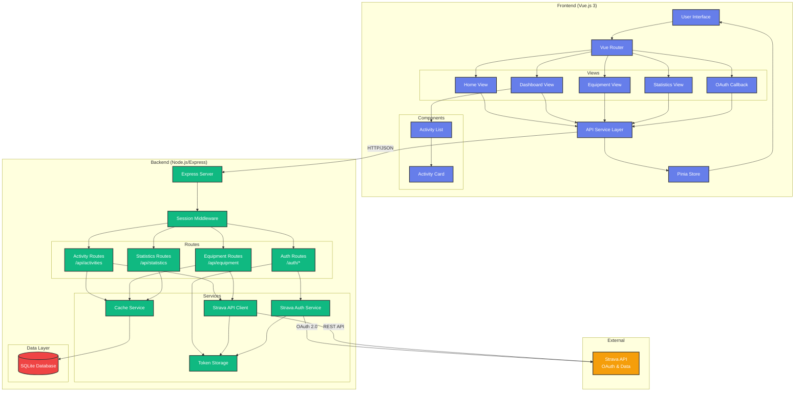

# Strava Activity Browser - Architecture

## System Overview

## Component Details

### Frontend Architecture

#### Views
- **Home**: Landing page with Strava login
- **Dashboard**: Main view showing paginated activity list with maps
- **Equipment**: Bike/shoe management with activity totals per gear
- **Statistics**: Cumulative distance charts by year/week
- **Callback**: OAuth redirect handler

#### State Management
- **Pinia Store**: Manages authentication state
- **API Service**: Centralized Axios client for backend communication

#### Key Features
- Session-based authentication with cookies
- Responsive grid layouts optimized for desktop
- Chart.js integration for statistics visualization
- SVG polyline rendering for activity maps

### Backend Architecture

#### Routes
- **Auth Routes** (`/auth/*`)
  - `/login` - Redirect to Strava OAuth
  - `/callback` - OAuth token exchange
  - `/status` - Check authentication
  - `/logout` - Clear session

- **Activity Routes** (`/api/activities`)
  - `GET /` - Paginated activities (50 per page)
  - Incremental caching (24-hour TTL)

- **Equipment Routes** (`/api/equipment`)
  - `GET /` - List all gear
  - `GET /:id/activities` - Activities for specific gear

- **Statistics Routes** (`/api/statistics`)
  - `GET /weekly-distance` - Cumulative distance by year/week

#### Services

**Strava API Client**
- Token refresh handling
- Automatic retry on 401
- Rate limit awareness

**Cache Service**
- SQLite-based persistence
- Athlete ID-based caching (survives container restarts)
- Tables: `activities`, `equipment`, `cache_metadata`
- TTL: 24 hours for activities and equipment

**Token Storage**
- In-memory Map for session tokens
- Tokens indexed by session ID
- Automatic token refresh

**Strava Auth Service**
- OAuth 2.0 authorization code flow
- Token exchange and refresh

### Data Model

#### SQLite Schema

**activities**
- Primary key: `id` (Strava activity ID)
- Indexed: `session_id`, `gear_id`, `start_date`
- Stores: distance, time, elevation, speed, heart rate, polyline

**equipment**
- Primary key: `id` (Strava gear ID)
- Indexed: `session_id`
- Stores: name, type, brand, model, distance, primary flag

**cache_metadata**
- Primary key: `key` (e.g., `activities:{athleteId}`)
- Stores: `last_fetched`, `expires_at`, metadata JSON

## Data Flow

### Authentication Flow
1. User clicks "Login with Strava" → Frontend redirects to `/auth/login`
2. Backend generates OAuth URL → Redirects to Strava
3. User authorizes → Strava redirects to `/auth/callback?code=...`
4. Backend exchanges code for tokens → Stores in TokenStorage
5. Backend saves session → Redirects to `/callback?success=true`
6. Frontend stores auth state → Redirects to `/dashboard`

### Activity Fetching Flow
1. Frontend requests `/api/activities?page=1&per_page=50`
2. Backend checks cache validity (24-hour TTL)
3. **Cache hit**: Return cached activities from SQLite
4. **Cache miss**:
   - Fetch from Strava API (up to 2000 activities)
   - Store in SQLite with athlete ID
   - Update cache metadata
   - Return activities
5. Frontend renders activity cards with maps

### Statistics Flow
1. Frontend requests `/api/statistics/weekly-distance`
2. Backend retrieves all activities from cache
3. Calculate ISO week numbers for each activity
4. Aggregate cumulative distance per year/week
5. Return JSON with 52 weeks per year
6. Frontend renders Chart.js line chart

## Key Design Decisions

### Caching Strategy
- **Athlete ID-based**: Cache survives session/container restarts
- **24-hour TTL**: Balance between freshness and API rate limits
- **Incremental updates**: Only fetch new activities after initial load

### Session Management
- **Express-session** with MemoryStore (not for production scale)
- **Athlete ID stored in session**: Links cache to user
- **Token storage separate**: In-memory Map, not in session

### Security
- HTTPS not enforced (development setup)
- Session cookies: `secure: false`, `sameSite: 'lax'`
- OAuth tokens never exposed to frontend
- Database stores no credentials

## Technology Stack

### Frontend
- Vue.js 3 (Composition API)
- Vite 5 (build tool)
- Vue Router 4
- Pinia (state management)
- Chart.js (statistics visualization)
- Axios (HTTP client)

### Backend
- Node.js 20
- Express.js 4
- better-sqlite3 (SQLite driver)
- express-session
- Axios (Strava API client)

### External
- Strava API v3
- OAuth 2.0
