# Strava Activity Browser - Architecture

## System Overview

```mermaid
graph TB
    subgraph "Frontend (Vue.js 3)"
        UI[User Interface]
        Router[Vue Router]
        Store[Pinia Store]

        subgraph "Views"
            Home[Home View]
            Dashboard[Dashboard View]
            Equipment[Equipment View]
            Statistics[Statistics View]
            Similar[Similar Activities View]
            Fitness[Fitness View]
            Admin[Admin View]
            Callback[OAuth Callback]
        end

        subgraph "Components"
            ActivityList[Activity List]
            ActivityCard[Activity Card]
            EditModal[Edit Activity Modal]
        end

        API[API Service Layer]
    end

    subgraph "Backend (Node.js/Express)"
        Server[Express Server]
        Session[Session Middleware]

        subgraph "Routes"
            AuthRoutes[Auth Routes<br/>/auth/*]
            ActivityRoutes[Activity Routes<br/>/api/activities]
            EquipmentRoutes[Equipment Routes<br/>/api/equipment]
            StatsRoutes[Statistics Routes<br/>/api/statistics]
            AdminRoutes[Admin Routes<br/>/api/admin]
            AthleteRoutes[Athlete Routes<br/>/api/athlete]
            FtpRoutes[FTP History Routes<br/>/api/ftp-history]
            FitnessRoutes[Fitness Routes<br/>/api/fitness]
            WhoopRoutes[Whoop Routes<br/>/whoop/*]
        end

        subgraph "Services"
            StravaAPI[Strava API Client]
            WhoopAPI[Whoop API Client]
            CacheService[Cache Service]
            TokenStorage[Token Storage]
            StravaAuth[Strava Auth Service]
            WorkoutName[Workout Name Util]
        end

        subgraph "Data Layer"
            SQLite[(SQLite Database)]
        end
    end

    subgraph "External"
        Strava[Strava API<br/>OAuth & Data]
        Whoop[Whoop API<br/>Recovery & HRV]
        OSM[OpenStreetMap<br/>Map Tiles]
    end

    %% Frontend flows
    UI --> Router
    Router --> Home
    Router --> Dashboard
    Router --> Equipment
    Router --> Statistics
    Router --> Similar
    Router --> Fitness
    Router --> Admin
    Router --> Callback

    Dashboard --> ActivityList
    ActivityList --> ActivityCard
    ActivityCard --> EditModal
    ActivityCard -->|tile requests| OSM

    Home --> API
    Dashboard --> API
    Equipment --> API
    Statistics --> API
    Similar --> API
    Fitness --> API
    Admin --> API
    Callback --> API

    Store --> UI
    API --> Store

    %% Backend flows
    API -->|HTTP/JSON| Server
    Server --> Session
    Session --> AuthRoutes
    Session --> ActivityRoutes
    Session --> EquipmentRoutes
    Session --> StatsRoutes
    Session --> AdminRoutes
    Session --> AthleteRoutes
    Session --> FtpRoutes
    Session --> FitnessRoutes
    Session --> WhoopRoutes

    AuthRoutes --> StravaAuth
    AuthRoutes --> TokenStorage

    ActivityRoutes --> CacheService
    ActivityRoutes --> StravaAPI
    ActivityRoutes --> WorkoutName

    EquipmentRoutes --> CacheService
    EquipmentRoutes --> StravaAPI

    StatsRoutes --> CacheService
    AdminRoutes --> CacheService
    AdminRoutes --> StravaAPI
    AthleteRoutes --> CacheService
    FtpRoutes --> CacheService
    FitnessRoutes --> CacheService

    WhoopRoutes --> CacheService
    WhoopRoutes --> WhoopAPI

    StravaAPI --> TokenStorage
    StravaAuth --> TokenStorage
    WhoopAPI --> CacheService

    CacheService --> SQLite

    %% External connections
    StravaAuth -->|OAuth 2.0| Strava
    StravaAPI -->|REST API| Strava
    WhoopRoutes -->|OAuth 2.0| Whoop
    WhoopAPI -->|REST API| Whoop

    %% Styling
    classDef frontend fill:#667eea,stroke:#333,stroke-width:2px,color:#fff
    classDef backend fill:#10b981,stroke:#333,stroke-width:2px,color:#fff
    classDef external fill:#f59e0b,stroke:#333,stroke-width:2px,color:#fff
    classDef data fill:#ef4444,stroke:#333,stroke-width:2px,color:#fff

    class UI,Router,Store,Home,Dashboard,Equipment,Statistics,Similar,Fitness,Admin,Callback,ActivityList,ActivityCard,EditModal,API frontend
    class Server,Session,AuthRoutes,ActivityRoutes,EquipmentRoutes,StatsRoutes,AdminRoutes,AthleteRoutes,FtpRoutes,FitnessRoutes,WhoopRoutes,StravaAPI,WhoopAPI,CacheService,TokenStorage,StravaAuth,WorkoutName backend
    class Strava,Whoop,OSM external
    class SQLite data
```

## Component Details

### Frontend Architecture

#### Views
- **Home**: Landing page with Strava login
- **Dashboard**: Main view showing paginated activity list with OSM map thumbnails
- **Equipment**: Bike/shoe management with activity totals per gear
- **Statistics**: Cumulative distance charts by year/week
- **SimilarActivities**: Groups repeated workouts by extracted name; shows summary stats and per-occurrence details (NP, HR)
- **Fitness**: Performance Management Chart (CTL/ATL/TSB), FTP history management, optional Whoop HRV chart
- **Admin**: Sync new activities from Strava; cache invalidation for full reload
- **Callback**: OAuth redirect handler

#### Components
- **ActivityCard**: Individual activity card with OSM map thumbnail, sport badge, and key stats; opens edit modal on click
- **ActivityList**: Paginated wrapper around ActivityCard; fetches on scroll/page change
- **EditActivityModal**: Modal for editing activity name, description, and gear; PUT to Strava + cache sync

#### State Management
- **Pinia Store**: Manages authentication state (`isAuthenticated`, `athlete`)
- **API Service**: Centralized Axios client (`withCredentials: true`); 401 interceptor redirects to Home

#### Map Thumbnails
Activity cards show real OpenStreetMap tiles behind the route polyline. `polyline.js` decodes
the Google-format encoded polyline and calculates the Web Mercator tile grid required to fill
the SVG viewport at the optimal zoom level. Tile URLs are standard OSM (`tile.openstreetmap.org`).

### Backend Architecture

#### Routes

- **Auth Routes** (`/auth/*`)
  - `GET /login` — Redirect to Strava OAuth
  - `GET /callback` — OAuth token exchange; saves athlete profile (FTP, weight) on login
  - `GET /status` — Check authentication
  - `POST /logout` — Clear session

- **Activity Routes** (`/api/activities`)
  - `GET /` — Paginated activities with incremental caching (30 per page default)
  - `GET /names` — Unique workout names appearing more than once, sorted by recency
  - `GET /by-name?name=x` — All activities matching a workout name, newest first
  - `GET /:id` — Single activity detail (live from Strava)
  - `PUT /:id` — Update name/description/gear (Strava + cache)

- **Equipment Routes** (`/api/equipment`)
  - `GET /` — List all gear (cached permanently)
  - `GET /:id` — Gear details (live from Strava)
  - `GET /:id/activities` — Activities for specific gear (from cache)

- **Statistics Routes** (`/api/statistics`)
  - `GET /weekly-distance` — Cumulative distance by year/ISO week

- **Admin Routes** (`/api/admin`)
  - `POST /invalidate-cache` — Clear activity cache to force full reload
  - `POST /sync-activities` — Fetch new activities since last cached; bypass TTL

- **Athlete Routes** (`/api/athlete`)
  - `GET /` — FTP, max HR, weight, and FTP history

- **FTP History Routes** (`/api/ftp-history`)
  - `GET /` — FTP history entries, newest first
  - `POST /` — Add entry `{ ftp, lthr?, valid_from }`
  - `DELETE /:id` — Delete entry

- **Fitness Routes** (`/api/fitness`)
  - `GET /pmc` — Performance Management Chart data (daily TSS, CTL, ATL, TSB)
  - `GET /hrv` — Whoop recovery/HRV data

- **Whoop Routes** (`/whoop/*`)
  - `GET /login` — Redirect to Whoop OAuth
  - `GET /callback` — Exchange code, initial sync, redirect to `/fitness`
  - `GET /status` — Connection state and last sync date
  - `POST /sync` — Incremental sync of recoveries and cycles
  - `POST /logout` — Delete Whoop tokens

#### Services

**Strava API Client** (`stravaApi.js`)
- Auto token refresh on 401 responses
- `getActivities`, `getActivity`, `updateActivity`, `getAthlete`, `getGear`, `getGearDetails`

**Whoop API Client** (`whoopApi.js`)
- Bearer token auth with auto-refresh using stored `whoop_tokens`
- `syncRecoveries` — paginated fetch from Whoop `/recovery`, upsert to SQLite
- `syncCycles` — paginated fetch from Whoop `/cycle`, upsert to SQLite

**Cache Service** (`cacheService.js`)
- Single source of truth for all SQLite read/write operations
- Fully JSDoc-annotated with `@typedef` blocks for all returned shapes
- See [SCHEMA.md](SCHEMA.md) for the database tables it manages

**Workout Name Utility** (`workoutName.js`)
- Strips `"Zwift - "`, `"TrainerRoad: "`, and `"WAHOO SYSTM: "` prefixes
- Strips trailing `" on <route>"` suffix from TrainerRoad titles
- Duplicated in `frontend/src/utils/workoutName.js` — keep in sync manually

**Token Storage** (`tokenStorage.js`)
- In-memory Map of `sessionId → tokens`; lost on restart (by design for this single-user setup)
- Strava tokens only; Whoop tokens are persisted in SQLite

**Strava Auth Service** (`stravaAuth.js`)
- OAuth 2.0 authorization code flow: `generateAuthUrl`, `exchangeCodeForTokens`, `refreshAccessToken`

### Data Model

Full schema with column types, nullability, indexes, and migration history: **[SCHEMA.md](SCHEMA.md)**

Summary of tables:

| Table | Purpose |
|-------|---------|
| `activities` | Cached Strava activity data (power, HR, polyline, gear) |
| `equipment` | Cached gear (bikes and shoes) |
| `cache_metadata` | TTL tracking per cache key |
| `athletes` | FTP, weight, max HR from Strava profile |
| `ftp_history` | Manual FTP timeline for historical TSS accuracy |
| `whoop_tokens` | Whoop OAuth tokens (one row per athlete) |
| `whoop_recoveries` | Daily HRV, recovery score, RHR, SpO2 from Whoop |
| `whoop_cycles` | Daily strain and energy from Whoop |

Database uses WAL mode for concurrency. File: `backend/data/strava_cache.db`.

## Data Flow

### Authentication Flow
1. User clicks "Login with Strava" → Frontend redirects to `/auth/login`
2. Backend generates OAuth URL → Redirects to Strava (`profile:read_all` scope required for FTP)
3. User authorizes → Strava redirects to `/auth/callback?code=...`
4. Backend exchanges code for tokens → Stores in TokenStorage
5. Backend saves athlete profile (FTP, weight) to `athletes` table
6. Backend saves session → Redirects to `/callback`
7. Frontend stores auth state → Redirects to `/dashboard`

### Activity Fetching Flow
1. Frontend requests `GET /api/activities?page=1`
2. Backend checks cache validity (24-hour TTL)
3. **Cache hit**: Return cached activities from SQLite
4. **Cache miss (first load)**:
   - Fetch from Strava API (up to 10 pages × 200 = 2000 activities)
   - Store in SQLite keyed by `athleteId`
   - Update cache metadata
5. **TTL expired (incremental update)**:
   - Fetch only activities newer than most recent cached `start_date`
   - Append new activities to SQLite
   - Reset TTL
6. Frontend renders activity cards with OSM map thumbnails

### PMC / Fitness Flow
1. Frontend requests `GET /api/fitness/pmc`
2. Backend retrieves all activities and FTP history from cache
3. For each activity, find the applicable FTP (latest `valid_from` ≤ activity date)
4. Compute TSS: power-based (NP²/FTP²) if `device_watts=1`, else hrTSS (avg_hr/LTHR)²
5. Sum daily TSS; walk day-by-day from first activity to today:
   - `CTL = CTL × (1−1/42) + TSS × (1/42)` (42-day fitness)
   - `ATL = ATL × (1−1/7) + TSS × (1/7)` (7-day fatigue)
   - `TSB = CTL − ATL` (form)
6. Return time series of `{ date, tss, ctl, atl, tsb }` plus power/HR ride counts

### Statistics Flow
1. Frontend requests `/api/statistics/weekly-distance`
2. Backend retrieves all activities from cache
3. Calculate ISO week numbers for each activity
4. Aggregate cumulative distance per year/week
5. Return JSON with 52 cumulative-distance entries per year

## Key Design Decisions

### Caching Strategy
- **Athlete ID-based**: Cache survives session/container restarts
- **24-hour TTL**: Balance between freshness and API rate limits
- **Incremental updates**: Only fetch new activities after initial load
- **Equipment has no TTL**: Gear rarely changes; use Admin → Invalidate Cache to refresh

### FTP History
Strava's API returns only the current FTP. A manual `ftp_history` table stores dated FTP values
so each historical activity is assessed against the FTP that was active at the time, making
CTL/ATL/TSB historically accurate. LTHR can be stored per entry; if null, estimated as `max_hr × 0.88`.

### Whoop Integration
Whoop is optional. Tokens are stored in SQLite (survives restarts). Recovery data is synced
on connect and incrementally on demand. HRV data is displayed alongside the PMC chart on the
Fitness page. Disconnecting deletes the token row but retains the recovery/cycle data.

### Session Management
- **Express-session** with MemoryStore (suitable for single-user deployment)
- **Athlete ID stored in session**: Links requests to the correct cache partition
- **Strava tokens in-memory only**: Lost on restart; user must re-authenticate

### Security
- HTTPS not enforced in development (configure a reverse proxy for production)
- Session cookies: `httpOnly`, `sameSite: 'lax'`, 7-day expiry
- OAuth tokens never exposed to the frontend
- Database stores no credentials

## Technology Stack

### Frontend
- Vue.js 3 (Composition API, `<script setup>`)
- Vite 5 (build tool)
- Vue Router 4
- Pinia (state management)
- Chart.js (statistics and PMC visualization)
- Axios (HTTP client)

### Backend
- Node.js 18 (Debian/glibc base image for pre-built native binaries)
- Express.js 4
- better-sqlite3 (synchronous SQLite driver)
- express-session
- Axios (Strava and Whoop API clients)

### External APIs
- Strava API v3 (OAuth 2.0, activity and profile data)
- Whoop Developer API v1 (OAuth 2.0, recovery and cycle data)
- OpenStreetMap tile server (map thumbnails, no API key required)

### Infrastructure
- Docker Compose (frontend nginx container + backend node container)
- nginx (static file serving + reverse proxy to backend)
- SQLite (persistent data, stored in named Docker volume `strava-data`)
- BuildKit npm cache mount (avoids recompiling native modules on rebuild)
